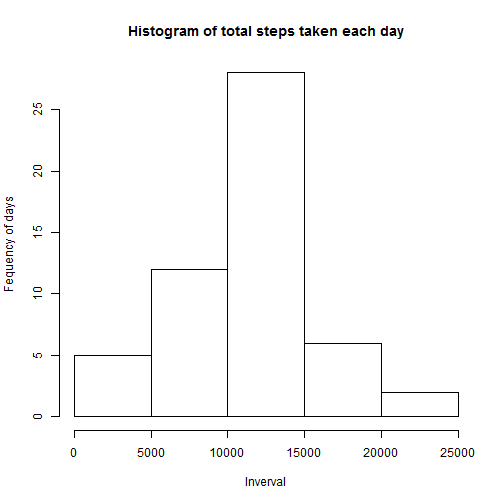
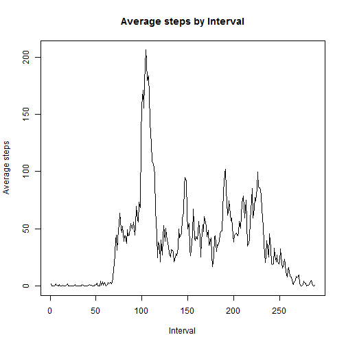
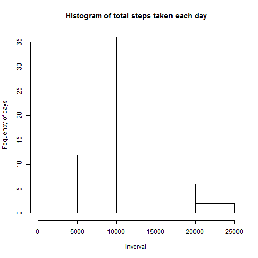
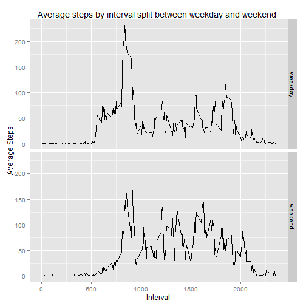

## What is mean total number of steps taken per day?
### Make a histogram of the total number of steps taken each day

This assumes the data file is already located in the working directory

```r
df<-read.csv('activity.csv')
dfTotal<-tapply(df$steps, df$date, FUN=sum)
hist(dfTotal, main='Histogram of total steps taken each day', xlab='Inverval', ylab='Fequency of days')
```

 

### Calculate and report the mean and median total number of steps taken per day


```r
mean(dfTotal, na.rm=TRUE)
```

```
## [1] 10766.19
```

```r
median(dfTotal, na.rm=TRUE)
```

```
## [1] 10765
```


## What is the average daily activity pattern?
### Make a time series plot (i.e. type = "l") of the 5-minute interval (x-axis) and the average number of steps taken, averaged across all days (y-axis)

```r
dfMeanInterval<-tapply(df$steps, df$interval, FUN=mean, na.rm=TRUE)
plot(dfMeanInterval, xlab='Interval', ylab='Average steps', type = "l", main='Average steps by Interval')
```

 

### Which 5-minute interval, on average across all the days in the dataset, contains the maximum number of steps?

```r
m<-which.max(dfMeanInterval) # get the array index of max average steps
dfMeanInterval [m] #return the row showing the interval and average steps
```

```
##      835 
## 206.1698
```


## Imputing missing values

### Calculate and report the total number of missing values in the dataset (i.e. the total number of rows with NAs)


```r
sum(is.na(df$steps))
```

```
## [1] 2304
```

### Devise a strategy for filling in all of the missing values in the dataset. The strategy does not need to be sophisticated. For example, you could use the mean/median for that day, or the mean for that 5-minute interval, etc.

As we have the mean for each interval it would make sense to apply the mean of an interval to any matching intervals with NA values.


```r
dfM<-data.frame(dfMeanInterval) # turn array into data.frame
# create new dataset by merging average steps to original data set by matching on interval
dfP<-merge(df,dfM, by.x = 'interval' , by.y = 'row.names')

nas <- is.na(dfP$steps)
 dfP$steps[nas] <- dfP$dfMeanInterval[nas]

dfpTotal<-tapply(dfP$steps, dfP$date, FUN=sum)
hist(dfpTotal, main='Histogram of total steps taken each day', xlab='Inverval', ylab='Fequency of days')
```

 


### Calculate and report the mean and median total number of steps taken per day of processed data


```r
mean(dfpTotal, na.rm=TRUE)
```

```
## [1] 10766.19
```

```r
median(dfpTotal, na.rm=TRUE)
```

```
## [1] 10766.19
```

The impact of imputing missing data on the estimates of the total daily number of steps would seem to increase the number of days inlcuded in the Histogram, but have no change on the average steps taken although there is a small change in the overall median value.

## Are there differences in activity patterns between weekdays and weekends?


```r
dfP$dow<-weekdays(as.Date(dfP$date)) # get day of week for date
# create function to flag as  weekday or weekend
fweek <-  function (x) ifelse(x %in% c("Saturday", "Sunday"), 'weekend','weekday')
# create factor as weekday or weekend
dfP$dow<-as.factor(apply (as.matrix(dfP$dow) , 2, fweek))
#dfP$dow<-lapply (dfP$dow , function (x) ifelse(x %in% c("Saturday", "Sunday"), 'weekend','weekday'))

#install ggplot2 if not installed
if("ggplot2" %in% rownames(installed.packages()) == FALSE) {install.packages("ggplot2")}
library(ggplot2)
#install dplyr if not installed
if("dplyr" %in% rownames(installed.packages()) == FALSE) {install.packages("dplyr")}
library(dplyr)

dfP$dfMeanInterval<-NULL #remove column as caused error when grouping
dfG<- group_by(dfP, dow, interval)
dfWD<-summarise(dfG, avgSteps=mean(steps))

# create panel plot to show differences between weekdays and weekends
p <- ggplot(dfWD, aes(interval, avgSteps)) + geom_line() +xlab('Interval')+ylab('Average Steps')
p + facet_grid(dow ~.)+ ggtitle('Average steps by interval split between weekday and weekend ')
```

 

As the plot shows there is a difference between weekday activity and weekend.


